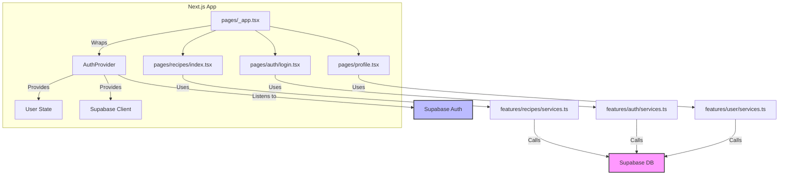

# Cooking Recipe Sharing App – Full Architecture (Next.js + Material UI + Supabase)

---

## 1. File & Folder Structure

```
recipe-app/
├── public/
│   └── ...                # Static assets (images, favicon, etc.)
├── src/
│   ├── components/        # Reusable UI components (Buttons, RecipeCard, etc.)
│   ├── features/          # Feature-based folders (recipes, auth, user, etc.)
│   │   ├── recipes/
│   │   │   ├── components/    # Feature-specific components
│   │   │   ├── hooks/         # Custom hooks for recipes
│   │   │   ├── services.ts    # API calls to Supabase for recipes
│   │   │   └── types.ts       # TypeScript types for recipes
│   │   ├── auth/
│   │   │   ├── hooks/
│   │   │   ├── services.ts
│   │   │   └── types.ts
│   │   └── user/
│   │       ├── hooks/
│   │       ├── services.ts
│   │       └── types.ts
│   ├── pages/             # Next.js pages (routes)
│   │   ├── _app.tsx       # App entry, providers, theme
│   │   ├── index.tsx      # Home page
│   │   ├── recipes/
│   │   │   ├── index.tsx      # List all recipes
│   │   │   └── [id].tsx       # Recipe detail page
│   │   ├── auth/
│   │   │   ├── login.tsx
│   │   │   └── register.tsx
│   │   └── profile.tsx    # User profile page
│   ├── layouts/           # Layout components (MainLayout, AuthLayout, etc.)
│   ├── theme/             # Material UI theme customization
│   ├── utils/             # Utility functions (date formatting, etc.)
│   ├── hooks/             # Global custom hooks (e.g., useAuth)
│   ├── services/          # Global services (Supabase client, etc.)
│   └── types/             # Global TypeScript types
├── .env.local             # Environment variables (Supabase keys, etc.)
├── next.config.js         # Next.js config
├── package.json
└── README.md
```

---

## 2. What Each Part Does

### **public/**
- Static files served as-is. Used for images, favicon, etc.

### **src/components/**
- Reusable UI elements (e.g., Button, Modal, RecipeCard) used across multiple features/pages.

### **src/features/**
- **recipes/**: All logic, components, and types related to recipes (listing, creating, editing, viewing).
- **auth/**: Authentication logic (login, register, password reset), hooks, and types.
- **user/**: User profile management, user-specific data, and related hooks/services.

### **src/pages/**
- Next.js routing. Each file/folder is a route.
- **_app.tsx**: App-wide providers (theme, auth context, etc.).
- **index.tsx**: Landing page.
- **recipes/**: Recipe listing and detail pages.
- **auth/**: Login and registration pages.
- **profile.tsx**: User profile page.

### **src/layouts/**
- Layout wrappers for different sections (e.g., main app layout, auth layout).

### **src/theme/**
- Material UI theme customization (colors, typography, etc.).

### **src/utils/**
- Helper functions (e.g., date formatting, slug generation).

### **src/hooks/**
- Global custom hooks (e.g., useAuth for authentication state).

### **src/services/**
- Global services (e.g., Supabase client initialization).

### **src/types/**
- Global TypeScript types/interfaces.

### **.env.local**
- Environment variables (Supabase URL, anon key, etc.).

---

## 3. State Management & Service Connections

### **State Management**
- **Local State**: Managed via React hooks (`useState`, `useReducer`) for UI state (form inputs, modals, etc.).
- **Global State**: 
  - **Authentication**: Managed via React Context (e.g., `AuthProvider` in `_app.tsx`), which wraps the app and provides user/auth state to all components.
  - **Feature State**: Feature-specific state (e.g., recipes list, user profile) managed within feature folders using custom hooks and context if needed.

### **Service Connections**
- **Supabase Client**: Initialized in `src/services/supabaseClient.ts` and imported wherever DB/auth interaction is needed.
- **API Calls**: Encapsulated in `services.ts` files within each feature (e.g., `features/recipes/services.ts` for recipe CRUD).
- **Auth**: Uses Supabase Auth (email/password, OAuth, etc.), with session state managed in context and persisted via Supabase's built-in mechanisms.

---

## 4. How Everything Connects



- **User interacts with UI** (Material UI components in pages/components).
- **Pages** use **feature hooks/services** to fetch/update data.
- **Services** use the **Supabase client** to interact with the database and authentication.
- **AuthProvider** manages user session and provides auth state to the app.

---

## 5. Example: Adding a Recipe

1. User clicks "Add Recipe" (UI in `components/RecipeForm`).
2. Form state managed locally in the component.
3. On submit, calls `features/recipes/services.ts` to insert recipe via Supabase.
4. On success, updates recipe list (could use SWR/React Query for cache, or refetch).
5. State updates propagate via hooks/context.

---

## 6. Security & Best Practices

- **Environment variables** for Supabase keys.
- **Row-level security** in Supabase for user data.
- **Client-side validation** (Material UI forms) + **server-side validation** (Supabase policies).
- **Auth context** ensures only authenticated users can add/edit recipes.

---

## 7. Extensibility

- Add features (comments, likes, search) as new folders in `features/`.
- Add new pages/routes in `pages/`.
- Reuse and extend UI components in `components/`.

---

**This architecture is modular, scalable, and follows best practices for a modern Next.js + Supabase + Material UI application.**  
If you want to proceed with implementation, toggle to Act mode.
